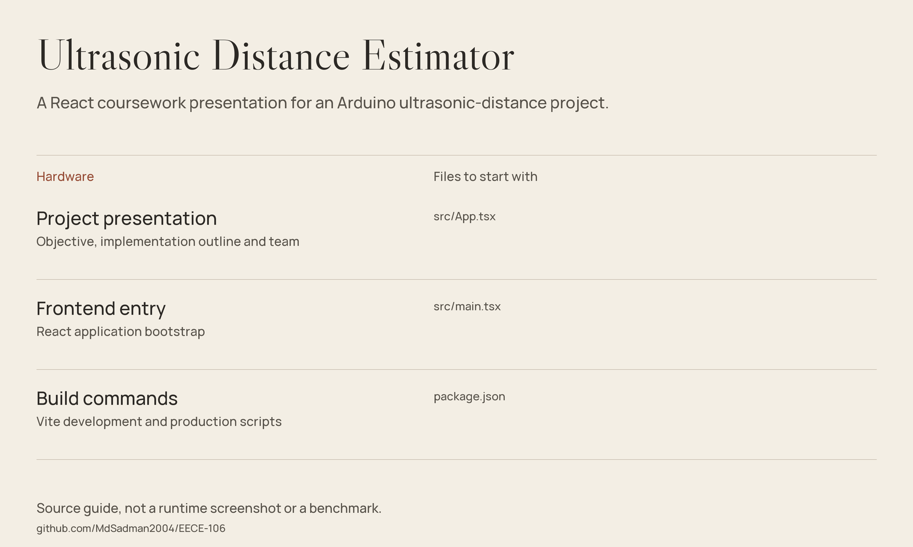

# Ultrasonic Distance Estimator

A React coursework presentation for an Arduino ultrasonic-distance project.



*Source guide drawn from the files in this repository; not a runtime screenshot or a fresh benchmark.*

[Getting started](#getting-started) · [Source guide](#source-guide) · [Scope & limitations](#scope--limitations)

## What is here

A single-page EECE-106 project presentation for **Group 2 at MIST**. The page explains the time-of-flight idea, describes an Arduino UNO / HC-SR04 / display setup, and presents the project team. Scroll-aware navigation and reveal animations are implemented in React.

This repository publishes the presentation frontend, not the Arduino measurement firmware.

## Getting started

Install a compatible Node.js LTS release and npm, then:

```bash
git clone https://github.com/MdSadman2004/EECE-106.git
cd EECE-106
npm install
npm run dev
```

Open the URL printed by Vite. `npm run build` creates the web bundle; `npm run preview` serves it locally. No automated test script is declared in `package.json`.

## Contributors

The source credits **Tanvir Ahmed**, **Md Sadman Bin Masud**, **Adri Bhowmick**, **Lohan Al Fardin**, and **Abu Zaid Umayer**. Student IDs are intentionally not repeated here.

## Source guide

| Component | File | Purpose |
| :-- | :-- | :-- |
| Project presentation | [src/App.tsx](src/App.tsx) | Objective, implementation outline and team |
| Frontend entry | [src/main.tsx](src/main.tsx) | React application bootstrap |
| Build commands | [package.json](package.json) | Vite development and production scripts |

## Scope & limitations

The frontend describes a proposed physical system; its text is not measurement evidence. This checkout contains no firmware, calibration dataset or recorded accuracy study. A texture is fetched externally, so do not assume the page is completely offline.

## Reuse & attribution

No standalone repository-wide license file is included in this checkout. Public source access is not a blanket license grant; check provenance and permissions before redistribution.
